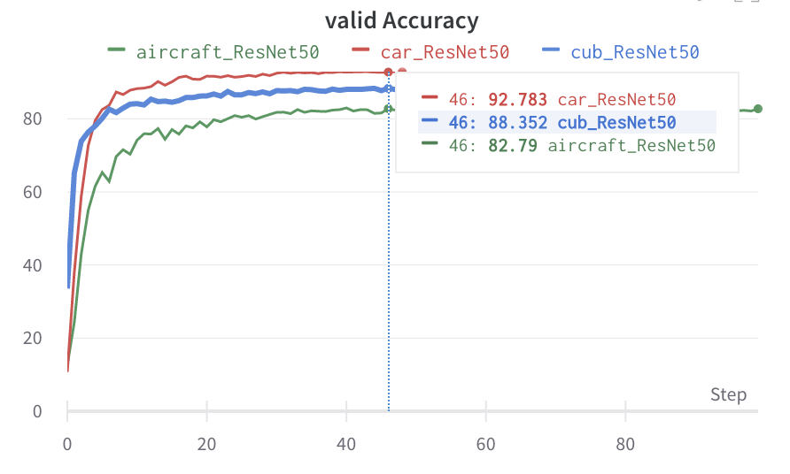
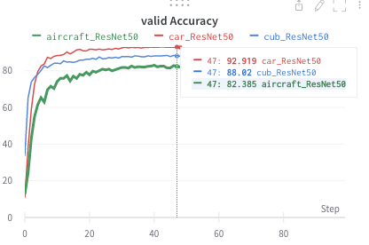

# Learning a Mixture of Granularity-Specific Experts for Fine-Grained Categorization

**This Project training 3 files at once as a Mixture of Granularity-Specific Experts Convolutional Neural Net and stores Experimental results. additionaly use wandb.**

**For paper implementations, see the section ["Papers and projects"](#papers-and-projects).**

## Setup the enviroment for evaluation

```bash
$cd FGVC
$sh experiment.sh 
```

## Default
Default inference. in `python main.py --seed 0 --dataset cub --imgsize 512 --model mgecnn --epochs 100 --batchsize 10 --gpu_ids 6,7`.

## Results




## Datasets
We upload the datasets used in the paper with our train/val/test splits [here](http://www.vision.caltech.edu/datasets/). We do not impose additional restrictions to the original dataset licenses, the sources of the data are listed in the paper appendix.

You could load the datasets with the following commands:


**File Structure**
```
├── dataset
│   ├── data
│   │     ├── aircraft
│   │     ├── stanfordcar
│   │     └── cubbird
│   ├── __init__.py
│   ├── augmentataion.py
│   └── etc..
│
├── models
│   ├── __init__.py
│   ├── base.py   
│   ├── grad_cam.py
│   └── local_cam.py
│
├── trainer
│   ├── __init__.py
│   ├── train.py   
│   └── infer.py
│   
├── main.py 
└── etc..
``` 

## Papers and projects

| Name                                                          | Location                                                        | Comment        |
| :------------------------------------------------------------ | :-------------------------------------------------------------- | :------------- |
| Learning a Mixture of Granularity-Specific Experts for Fine-Grained Categorization  | [link](https://openaccess.thecvf.com/content_ICCV_2019/papers/Zhang_Learning_a_Mixture_of_Granularity-Specific_Experts_for_Fine-Grained_Categorization_ICCV_2019_paper.pdf) | ICCV 2019     |
| Grad-CAM: Visual Explanations from Deep Networks via Gradient-based Localization | [link](https://arxiv.org/abs/1610.02391)     | CVPR 2019     |

## How to cite
```
@article = {
    title = {Learning a Mixture of Granularity-Specific Experts for Fine-Grained Categorization},
    author = {Wongi Park},
    journal = {GitHub},
    url = {https://github.com/kalelpark/DeepLearning-for-Tabular-Data},
    year = {2022},
}
```
